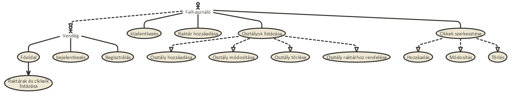
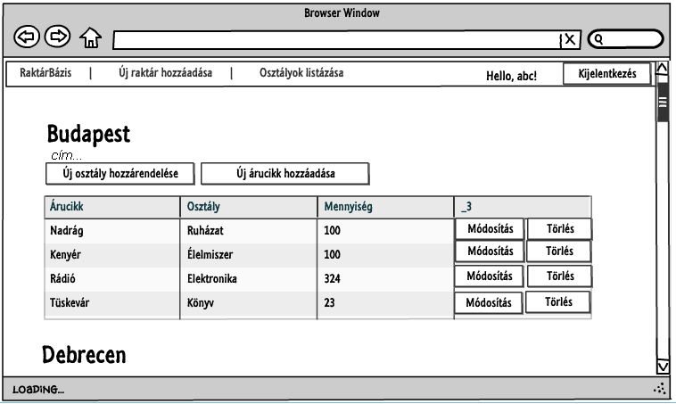
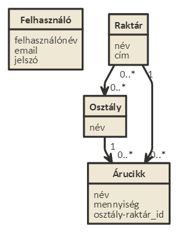

#Alkalmazások fejlesztése - Beadandó
======
##Raktárkészlet-nyilvántartó alkalmazás
-----
###Követelményanalízis
####Követelmények
* Funkcionális elvárások
  - Lehessen regisztrálni az alkalmazás használatához
  - Regisztrált felhasználók (továbbiakban: felhasználók) új raktárt vehessenek fel
  - Felhasználók a raktárakhoz kategória szerinti osztályokat vehessenek fel
  - Felhasználók új raktárcikket vehessenek fel darabszámmal egy kiválasztott raktár valamelyik osztályához
  - Felhasználók megtekinthessék az általuk felvitt raktárcikkeket és azok darabszámát
  - Felhasználók szerkeszthessék a raktárcikkeik darabszámát
  - Felhasználók törölhessék a raktárcikkeiket a listáról
* Nem funkcionális követelmények
  - Átlátható megjelenés
  - Gyors működés
  - Könnyű kezelhetőség
  
  
####Szakterületi fogalomjegyzék
  - **Raktár:**  Fizikai objektumok tárolására használt épület
  - **Árucikk:** Raktárban tárolt objektum
  - **Osztály:** Árucikkek kategorizálására alkalmas megnevezés
 
####Használatieset-modell
* Szerepkörök
  - vendég: a főoldal tartalmához fér hozzá, rögzíteni, módosítani, törölni nem tud
  - felhasználó: a vendég szerepkörén túl raktárt, osztályt, osztály-raktár hozzárendelést, árucikkeket tud hozzáadni és/vagy szerkeszteni, törölni 
* Használati eset diagram
  - 
* Raktár hozzáadásának folyamata
  - 
  
 
###Tervezés
####Architektúra terv
* Oldaltérkép
  * Publikus:
    - Főoldal
      - Raktárak és cikkeik listázása
    - Bejelentkezés
    - Regisztrálás
  * Felhasználó
    - Főoldal
      - Raktárak és cikkeik listázása
      - Raktárhoz osztály rendelése
      - Raktárhoz árucikk hozzáadása
      - Árucikkek módosítása és törlése
    - Bejelentkezés/Kijelentkezés
    - Új raktár hozzáadása
    - Osztályok listázása
      - Új osztály hozzáadása
      - Osztály módosítása és törlése
      
* Végpontok
  - GET /: főoldal
  - GET storage/create: új raktár hozzáadása
  - POST storage/create: új raktár hozzáadása, adatok küldése
  - GET storage/:id/add_department: raktárhoz osztály rendelése
  - POST storage/:id/add_department: raktárhoz osztály rendelése, adato küldése
  - GET storage/:id/add_item: új árucikk hozzáadása raktárhoz 
  - POST storage/:id/add_item: új árucikk hozzáadása raktárhoz, adatok küldése
  - GET departments: osztályok listázása
  - GET department/create: új osztály létrehozása
  - POST department/create: új osztály létrehozása, adatok küldése
  - GET department/:id/edit: osztály szerkesztése
  - POST department/:id/edit: osztály szerkesztése, adatok küldése
  - GET department/:id/delete: osztály törlése
  - GET item/:id/edit: árucikk szerkesztése
  - POST item/:id/edit: árucikk szerkesztése, adatok küldése
  - GET item/:id/delete: árucikk törlése
  - GET register: regisztráló oldal
  - POST register: regisztrálási adatok küldése
  - GET login: bejelentkező oldal
  - POST login: bejelentkezési adatok küldése
  - GET logout: kijelentkező oldal
  

####Felhasználóifelület-modell
* Oldalvázlat (Főoldal)
  - 

####Osztálymodell
- Adatmodell
 - 

###Implementáció
+ A fejlesztői környezet:
  - Az alkalmazás Visual Studio Code IDE-n készült el és Node.js nyelven, AdonisJs keretrendszerben íródott.
  
+ Könyvtárstruktúrában lévő mappák funkciójának bemutatása
  - /: A szerver elindításához valamint az útvonalkezeléshez szükséges fájlokat tartalmazza
  - /docs: A dokumentációban használt képeket tartalmazza 
  - /app/Model: az adatok tárolásához szükséges struktúrák
  - /node_modules: az alkalmazás működéséhez szükséges külső modulok
  - /resources/views: az alkalmazás képi megjelenítéséhez és a felhasználóval való kommunikációhoz szükséges template-ek
  
###Felhasználói dokumentáció
####A futtatáshoz ajánlott hardver-, szoftver konfiguráció
A futtatáshoz bármilyen böngészésre megfelelő hardverkonfiguráció és egy tetszőleges böngésző (Google Chrome, Mozilla Firefox,  Opera, stb...) legújabb verziója szükséges.

####Telepítés lépései
Az alkalmazás Github-ról való letöltéséhez a jobb oldali panel 'Download ZIP' gombjára kell kattintani. Szervert csak a Node.js szoftverrendszerrel rendelkező számítógépről lehet indítani. 

####A program használata
A főoldalon a felvitt raktárok és azok árucikkei táblázatos formában láthatók. Az alkalmazás további funkcióit csak bejelentkezett felhasználók érhetik el. A belépéshez a főoldalon a Bejelentkezés gombra kattintás után megjelenő űrlapon kell a felhasználói adatokat megadnunk. Ha még nincs felhasználói fiókunk, ugyanezen a felületen a Regisztráció gombra kattintva létrehozhatunk.

Belépés után lehetőség nyílik az árucikkek törlésére valamint mennyiségének és osztályának módosítására a mellettük lévő gombok használatával. Minden raktárhoz hozzárendelhetünk korábban felvitt osztályokat, és újabb árucikkekkel is bővíthetjük készletüket. 

A menüsor Új raktár hozzáadása gombjának megnyomása után van lehetőségünk raktárt létrehozni. Ehhez a raktár nevét (a dokumentációban ezt városnevekkel jelöltük) és annak címét kell megadni. Sikeres felvitel után a főoldalra jutunk.

Ugyanitt találjuk az Osztályok listázása gombot is, melynek megnyomásával a létrehozott osztályokat tudjuk megtekinteni. Itt tudunk új osztályt is hozzáadni. Az osztályok módosítása és törlése az árucikkekéhez hasonló módon történik.

Munkamenetünk befejezése esetén a Kilépés gombra kattintva jelentkezhetünk ki.

###Javascript-es funkciók
- Raktár nevére kattintás esetén megjelenik annak címe, újabb kattintás után eltűnik.
  - Érintett fájlok:
    - public/scripts/mainFunctions.js
- Árucikk darabszámának növelése eggyel a főoldalon gombnyomás hatására (Ajax)
  - Érintett fájlok:
    - public/scripts/mainFunctions.js
    - Controllers/ItemController.js
- Árucikk darabszámának csökkentése eggyel a főoldalon gombnyomás hatására (Ajax)
  - Érintett fájlok:
    - public/scripts/mainFunctions.js
    - Controllers/ItemController.js
- Regisztráció felugró ablakon keresztül, űrlapellenőrzéssel (Ajax)
  - Érintett fájlok:
    - public/scripts/ajaxRegister.js
    - Controllers/UserController.js
- Árucikk törlése a főoldalon gombnyomás hatására, felugró megerősítő ablakkal, oldalújratöltés nélkül (Ajax)
  - Érintett fájlok:
    - public/scripts/mainFunctions.js
    - Controller/ItemController.js
    
###Tesztelés
A tesztesetek a Selenium IDE Firefox plugin segítségével lettek rögzítve, mely az alábbi hivatkozásról tölthető le: 
https://addons.mozilla.org/hu/firefox/addon/selenium-ide/
Telepítés után a test könyvtár TestSuite fájlját betöltve futtathatjuk a teszteseteket.
 
A tesztesetek az alábbiak:
 - Bejelentkezés, egy árucikk darabszámának növelése és csökkentése a főoldalon, kijelentkezés
 - Bejelentkezés, kattintás egy árucikk Módosítás gombjára, a mennyiség módosítása kétszer, kijelentkezés
 - Bejelentkezés, új osztály felvitele, hozzáadott osztály törlése, kijelentkezés
 - Bejelentkezés, új árucikk hozzáadása, hozzáadott árucikk törlése, kijelentkezés
  
